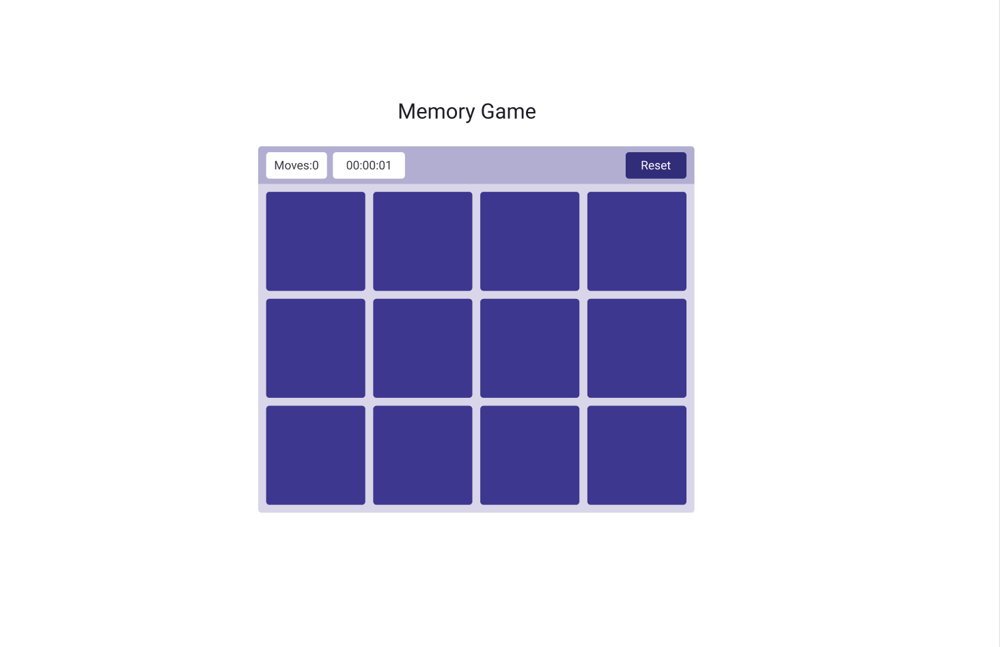
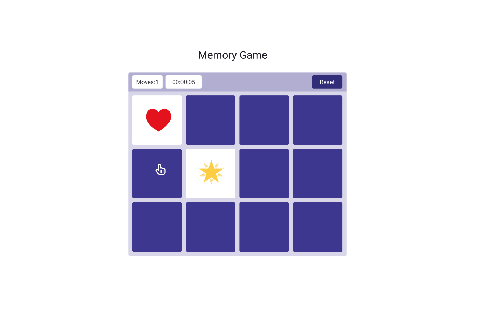
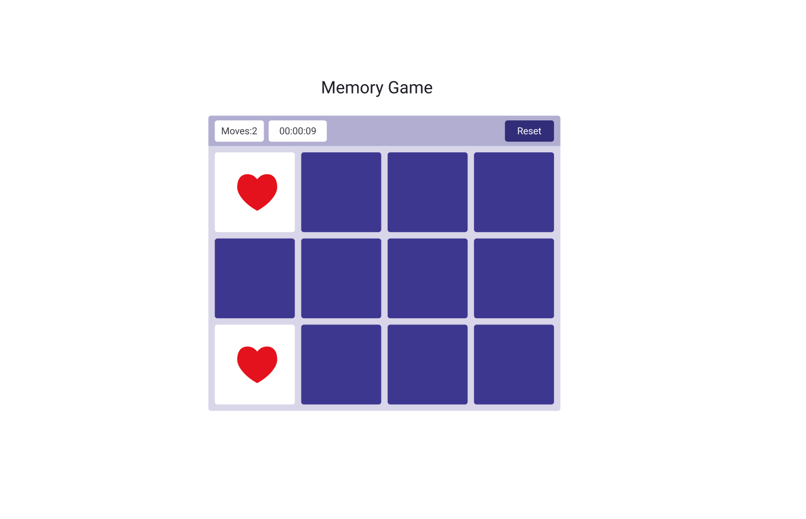
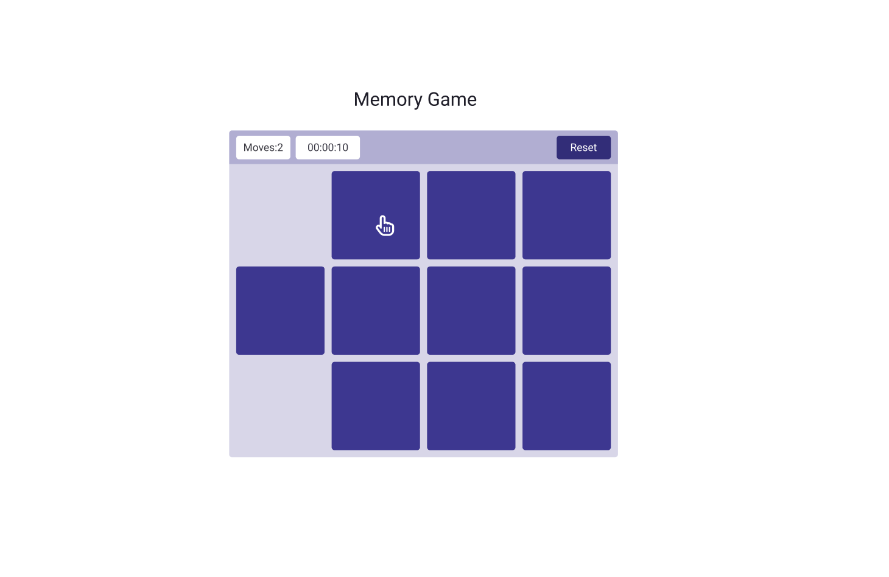

# Memory-Matching-Game
> Click on the cards to reveal a shape. If they are a match, they will stay at board if they aren't match they flip again. You have 60 seconds to clear the board! 

  <https://masinakhjiri.github.io/project1-Memory-game/>

# Screenshots

# Installation Instructions
## Steps
1. This game will have 12 cards. When you click on each box, they will flip over and reveal either a shape or an image.

2. As well, when you click on a play game button the timer will begin counting down from 60 seconds.

3. Each square will show for one second before flipping back to a blank screen.

4. When a player clicks on two squares that have the same image or shape, the two squares will remain on board and don't flip again.

5. Every match will add a certain amount of moves count.

6. Whenever all cards matched in 60 seconds the message showes victory otherwise the game is over.

# User stories
## MVP Goals

* As a player,I should be able to start new memory game.
* As a player,I want to be able to click on cards sequentially to turn them over(flipping first card then second card and so on)
* As a player,I can see the cards that have been correctly matched and counts of total moves.
* As a player,once two cards matched correctly , they disappear from the interface.
* As a player,I want to see the message when I win/lose.
* As a player,I could not to continue playing when I win/lose.
* As a player,I won't be able to play a game without resetting the game.
* As a player,I want to view the result of a game.
* As a player,all pairs have been matched correctly before the time is up then the player win.

## Stretch Goals

* As a player,I can start at level 1 and progress to level 5(each level is more difficult than the previous one).
* As a player,I can choose between single player or two player.
* As a player,when two cards matched, I want to listen the audio.
# Wireframes

# Technologies Used 
- HTML
- CSS
- JAVASCRIPT